# Nested Objects Intelligence OS agent control plane

> **Superseded for implementation status on 2026-09-03.** Preserve this document as the architecture and safety design record. Its dated rollout, empty-allowlist, and unapplied-migration statements are historical. The only current plan, status ledger, decision record, and handoff is the [canonical execution ledger](intelligence-os/issue-318-foundation-execution-ledger.md).

Status: Issue #318 foundation implementation, staging-first, 2026-08-27.

This document describes the reviewable Intelligence OS foundation. It is an operating control plane, not an autonomous production operator. Deterministic logic, durable evidence, idempotency, source authority, and explicit owner approval take precedence over model calls. Model execution is disabled by default, consequential actions stop at `approved`, and no external mutation executor is installed.

## Architecture

```mermaid
flowchart LR
    ConversionEvents[(conversion_events)] --> Identity[Canonical identity projection]
    Profiles[(profiles)] --> Identity
    Outseta[Outseta membership evidence] --> Identity
    Identity --> Member360[(member_360)]
    Member360 --> Metrics[(business_metrics_daily)]
    Collectors[SEO, AEO, content, opportunity, ActiveCampaign read-only collectors] --> Observations[(sensor_observations)]
    Metrics --> Signal[(intelligence_signals)]
    Observations --> Signal
    Observation[Observation] --> Signal
    Signal --> Investigation[Investigation / agent_task]
    Investigation --> Recommendation[Recommendation]
    Recommendation --> ProposedAction[ProposedAction]
    ProposedAction --> ApprovalState[Approval state]
    ApprovalState --> Outcome[Outcome]
    Outcome --> Measurement[Measurement]
    Measurement --> Learning[Candidate learning]
    Signal --> Orchestrator[Operations Orchestrator]
    Orchestrator --> Specialists[Revenue, Growth, Industry, Marketing]
    Specialists --> Recommendation
    ProposedAction --> Owner[Autumn owner review]
    Owner -. approval does not execute .-> ApprovalState
```



The operating loop is deliberately explicit:

`Observation --> Signal --> Investigation --> Recommendation --> ProposedAction --> ApprovalState --> Outcome --> Measurement --> Learning`

Each arrow is represented by an immutable `agent_trace_links` record. The link carries the durable run, experiment reference when present, evidence/source references, `correlation_id`, immediate `causation_id`, and a content checksum. The database rejects changed content under a reused idempotency key.

## Operating loop and shared state

1. Existing collectors produce raw records or bounded observations. `conversion_events` remains the sole first-party behavior and conversion ledger; `agent_events` is orchestration audit, not a replacement event ledger.
2. The canonical projector joins `profiles` and `conversion_events`, detects identifier collisions, stitches only unambiguous anonymous actors, and maintains projection-managed identity links. A later projection revokes absent links with audit provenance; it never silently transfers an identifier between members.
3. `member_360` exposes the current canonical identity, authoritative membership snapshot, operational profile, and authority-conflict count.
4. The daily projector converts the canonical view into long-form `business_metrics_daily`. Unknown amounts remain null with an explicit state; zero is never invented.
5. Deterministic sensors and specialists turn supported observations into `intelligence_signals`. Recurrence updates the existing producer/fingerprint signal rather than creating a parallel signal universe.
6. The Operations Orchestrator creates bounded investigations (`agent_tasks`), recommendations, experiments, and proposal-only `agent_actions` in one durable workflow context.
7. Autumn may approve or reject the exact payload through the protected surface. Approval records the decision and the same correlation path but does not execute anything.
8. A later read-only observation can record an outcome, a planned or completed measurement, and a candidate learning. Completion requires the committed minimum sample size and duration. A learning is never authoritative until separately reviewed.

## Sources and authority

| Fact | Authority | Control-plane rule |
| --- | --- | --- |
| First-party behavior and conversion delivery | `conversion_events` | Reuse the existing ledger; deduplicate by stable delivery keys. |
| Canonical application identity | Supabase profile ID plus normalized identity links | Stable IDs beat names/email; collisions are conflicts, never silent merges. |
| Membership ownership and entitlement | Outseta, projected into Supabase | ActiveCampaign tags cannot grant access or establish paid status. |
| Subscription lifecycle | Outseta | Supabase is the shared operational projection. |
| Revenue amounts | Verified billing/normalized financial inputs | Stripe is authoritative only after verified synchronization; unknown stays unknown. |
| Application operational memory | Supabase | Runtime writes use server-only, reviewed RPCs and a staging destination sentinel. |
| Marketing execution and engagement | ActiveCampaign | Read-only sensing in this foundation; every cleanup is a proposed action. |
| SEO/AEO/content opportunity reports | Existing repository collectors | Adapters preserve existing report compatibility and identify live, baseline, or fixture provenance. |
| External industry evidence | Approved read-only research source | Store publication/event dates, licensing caveat, provenance, confidence, and relevance. |

Email can be evidence, but it is not a durable approval identity and is not sufficient to silently join ambiguous people. The `member_identity_links` uniqueness and synchronization function make those conflicts visible.

## Core contracts

- `intelligence_signals`: an evidenced business observation worth investigation. It has producer/fingerprint idempotency, severity, priority, status, source references, and correlation.
- `agent_events`: an internal run, decision, nonce, and lifecycle audit event. It is not product behavior.
- `agent_tasks`: a bounded investigation or orchestration assignment linked to its source signal, run context, retry budget, and immediate cause.
- `agent_recommendations`: a structured recommendation linked to signal IDs and evidence references. It cannot execute.
- `agent_actions`: a proposal containing the exact payload, evidence, source references, risk, approval requirement, signal/task/run/experiment references, and execution guard. C8 adds trace links; it does not add an executor.
- `agent_runs` and workflow steps: durable workflow identity, business idempotency, provider/runtime metadata, retry/stale state, timestamps, concise error and tool summaries, verification, optional token/cost fields, and correlation.
- `experiments`: a hypothesis and explicit primary metric with minimum sample and duration. Results cannot become conclusive before both thresholds are met.
- `agent_outcomes`, `agent_measurements`, and `agent_learnings`: immutable, checksum-bound learning memory. Measurements can be planned first and linked to a later outcome. Learnings remain `candidate` and contain concise evidence-backed conclusions, never private reasoning.

Only inputs, structured outputs, evidence, source references, concise rationale, decisions, tool metadata, status transitions, errors, usage/cost, outcomes, measurements, and candidate learnings belong in persistence. Chain-of-thought, hidden reasoning, scratchpads, and private deliberation do not.

## Specialists and orchestrator

### Revenue Agent v1

Uses normalized financial metrics, preserves unknown states, compares defensible periods, and refuses ActiveCampaign as revenue or membership truth. It returns the metric, current/comparison values, delta, confidence, data quality, supported driver, evidence, and follow-up.

### Growth Agent v1

Compares current week, prior week, trailing four weeks, and trailing twelve weeks across signup, upgrade, churn, trials, directory/firm activity, paywall intent, profile and training completion, opportunities, acquisition, marketing engagement, and SEO inputs. It emits structured anomalies and durable signals, using Revenue for financial truth.

### Industry Intelligence Agent v1

Normalizes approved research fixtures or future read-only sources with publication/event dates, provenance, confidence, relevance, segment, risk, and licensing caveat. High-value findings become signals; prose alone is not the output.

### Marketing Agent v1

Consumes Revenue and Growth results plus read-only lifecycle/engagement observations. It creates identifier-free audience definitions, recommendations, experiments, internal copy drafts, and approval-required proposals. It never sends, publishes, enrolls, tags, or edits ActiveCampaign.

### Operations Orchestrator v1

Owns `conversion_review`, `daily_business_health`, and `weekly_operating_review`. It invokes typed specialists, reads current evidence, ranks at most three priorities, persists tasks/recommendations/experiments/proposals, enforces policy, and stays quiet when no material issue exists.

## Workflows and triggers

| Workflow | Trigger | Required behavior |
| --- | --- | --- |
| `conversion_review` | Protected event trigger | Normalize metrics; invoke Revenue, Growth, and Marketing; persist signals, investigations, recommendations, experiments, proposals, and an executive summary idempotently. |
| `daily_business_health` | One protected daily trigger or manual test | Check lifecycle, identity, access/plan, routing, cancellation, source health, collector failure, and stale tracking; emit only meaningful anomalies and complete quietly when healthy. |
| `weekly_operating_review` | One protected weekly trigger or manual test | Gather metrics, unresolved signals, experiments, prior actions, industry and marketing evidence, and live SEO/AEO observations; return at most three priorities and only explicit Autumn decisions. |

Protected event contracts cover member creation, trial, upgrade, downgrade, cancellation, payment failure, paywall, training completion, firm inquiry, opportunity ingestion, and critical integration failure. There is no Production schedule. Existing source-specific schedules remain collectors feeding shared state rather than independent decision systems.

## Sensor integration map

| Existing source | Adapter/output | Consumer | Foundation boundary |
| --- | --- | --- | --- |
| `conversion_events` | Canonical projection, daily metrics, lifecycle signals | Conversion and daily reviews | Existing ledger retained; duplicate delivery and ambiguous anonymous identity fail safely. |
| `seo-content-monitor` | Typed observation, source health, checksum, SEO signal | Weekly review | Live report can be passed directly; checked-in JSON remains a labeled baseline. |
| `ai-aeo-monitor` | Typed observation, source health, checksum, AEO signal | Weekly review | Same deployment-safe direct input; no hidden build-time freshness claim. |
| `content-brief-generator` | Candidate action | Approval queue | `publishAllowed=false`; no autonomous publication. |
| Adzuna/opportunity ingestion | Existing deduplicated opportunity source | Future Opportunity Agent | No second ingestion path or autonomous outreach. |
| ActiveCampaign | Owner-allowlisted, stable-ID, bounded GET-only sensor | Daily/weekly lifecycle and marketing analysis | No emails in classification rows, no membership/revenue authority, no mutation. |

Old scheduled reports and checked-in report shapes remain until one successful staging parity cycle proves equivalent or better evidence, idempotency, and review output.

## Approval identity and policy

The approval identity and policy boundary uses Autumn's exact stable Outseta subject ID. One active owner is permitted initially. Email, display role, and client UI state are insufficient authority. Delegation is an explicit future scope and is disabled by default.

The protected staging endpoints require an HMAC signature over the method, path, origin, stable subject, timestamp, nonce, and exact body digest. The database independently consumes each hashed nonce once. Approval/rejection locks the action, compares the expected version and exact payload, snapshots the approved payload immutably, records correlated audit events and an approval-state trace link, and returns `executionStarted=false`.

Unauthorized users receive 401/403. Approval cannot attach an executor, begin execution, send email, mutate ActiveCampaign, publish content, change pricing/entitlements, merge code, or deploy Production. The foundation legitimately stops at `approved`.

## Correlation, causation, and observability

One `correlation_id` identifies the complete business thread. `causation_id` points to the immediate predecessor where applicable: source/run to signal, signal to task/recommendation/action, action to outcome/approval state, outcome to measurement, and outcome-backed measurement to learning. Durable run IDs, workflow-provider IDs, signal/task/action IDs, and experiment IDs remain separate addressable references.

`agent_trace_links` makes cross-table relationships queryable without storing a large opaque transcript. The owner-only `get_agent_correlation_trace` RPC returns links, outcomes, measurements, and candidate learnings for a correlation. Evidence and decisions are visible; private reasoning is neither accepted nor stored.

Runtime and database protections are complementary:

- business idempotency claims prevent duplicate runs;
- completed steps are reused and never reset on retry;
- bounded stale-run recovery has a maximum attempt count;
- artifact and learning records reject changed checksums under a reused key;
- source/fingerprint recurrence updates one signal;
- duplicate workflow delivery does not create duplicate actions or trace links;
- errors, retry state, verification, tool summaries, and optional usage/cost are durable and bounded.

## Adding a specialist

1. Define a narrow typed input/output contract under `apps/agent-runtime/src/agents` and register it disabled by default.
2. State its source authority and forbidden inferences. Prefer deterministic logic when it is reliable.
3. Return structured evidence, concise rationale, source references, correlation, proposal-only actions, and explicit model/tool metadata.
4. Expose no mutation tool. Any consequential capability must become an `agent_action` governed by policy.
5. Add deterministic unit fixtures, Workflow integration coverage, idempotency/correlation assertions, and static boundary checks.
6. Document its owner workflow and Phase 2 rollout gate before enabling any credential or model.

## Adding a sensor

1. Reuse the working collector; do not duplicate authentication or ingestion.
2. Implement the typed sensor contract with a stable source ID, checksum, provenance mode, source generation/observation time, health/staleness, and correlation.
3. Default deny external assets. Use stable IDs and an owner-reviewed allowlist, never names alone.
4. Persist a bounded observation batch idempotently before the consuming workflow step.
5. Emit aggregate, PII-safe metrics/signals and proposal-only candidate actions.
6. Add fixture, recurrence, changed-payload, stale-source, permission, and no-mutation tests plus a parity plan.

## Local and fixture operation

Node 22.16 through 22.x is required by the isolated package.

```powershell
cd apps/agent-runtime
npm.cmd ci
npm.cmd run validate
```

`npm run validate` performs formatting, dependency smoke, strict TypeScript checks, the isolated Node suite, real Workflow DevKit integration tests, migration-contract checks, Preview guards, and specialist checks. The package's TypeScript build is expected. Repository `AGENTS.md` prohibits the interactive Next.js production build; use the member app's lint, strict TypeScript, audit scripts, and development server for web verification.

All unit and Workflow fixtures use the reserved synthetic identity namespace. They require no OpenAI, ActiveCampaign, Outseta, Stripe, Production Supabase, or real member/contact data. The OpenAI adapter fails closed when model execution is disabled.

## Staging validation

Apply new migrations only through the reviewed staging migration path after positively verifying the Supabase project reference, hostname, committed destination allowlist, and service-role-only database sentinel. Then run each `supabase/validation/20260827_validate_*.sql` script. Each script uses synthetic records inside a transaction and ends with `ROLLBACK`; verify the post-rollback notices.

C3 through C8 migrations are repository-complete but were not applied during this implementation because the allowlist is intentionally empty and no approved staging credential was used. Never substitute the member application's unverified environment file.

## Vercel deployment

The isolated project is `nested-objects-agent-runtime`, rooted at `apps/agent-runtime`. Its Production Branch is `deploy/agent-runtime-production-disabled`, not `main`; Production has no runtime variables or domain. Phase C2 Preview was synthetic, dry-run, non-persistent, model-disabled, and mutation-disabled. Later durable/admin profiles require a reviewed staging destination and Preview/Development variables only.

Do not promote a Preview, add Production variables, configure a Production schedule, attach a custom domain, or connect Production Supabase as part of the foundation.

## Environment variables and secrets

| Variable | Scope | Purpose |
| --- | --- | --- |
| `AGENT_RUNTIME_ENV`, `AGENT_RUNTIME_MODE`, `AGENT_RUNTIME_VERSION`, `AGENT_TRACE_NAMESPACE` | Preview/Development | Base runtime identity and dry-run mode. |
| `AGENT_MUTATIONS_ENABLED=false`, `AGENT_MODEL_EXECUTION_ENABLED=false` | Preview/Development | Fail-closed capability switches. |
| `AGENT_PREVIEW_API_TOKEN`, `AGENT_PREVIEW_SYNTHETIC_ONLY=true`, `AGENT_PREVIEW_PERSISTENCE_ENABLED=false` | Phase C2 Preview/Development | Synthetic preview authentication and isolation. |
| `AGENT_WORKFLOW_PROVIDER=vercel_workflow`, `AGENT_DURABLE_PERSISTENCE_ENABLED=true`, `AGENT_DURABLE_SYNTHETIC_ONLY=true` | Reviewed durable staging only | Enables the C3 durable path after destination review. |
| `AGENT_STAGING_WORKFLOW_TOKEN`, `AGENT_STAGING_PROJECT_REF`, `SUPABASE_URL`, `SUPABASE_SERVICE_ROLE_KEY` | Server-only reviewed staging | Workflow authentication and exact staging destination. |
| `AGENT_ADMIN_ENABLED`, `AGENT_ADMIN_SHARED_SECRET`, `AGENT_ADMIN_AUTUMN_SUBJECT_ID`, `AGENT_ADMIN_ALLOWED_ORIGIN` | Server-only reviewed staging | Protected owner API and exact member-web staging origin. |
| `OPENAI_API_KEY`, `OPENAI_AGENT_MODEL`, `OPENAI_AGENT_MAX_TURNS` | Optional later Preview | Model smoke only; execution remains disabled by default and tools remain non-mutating. |

Secrets belong only in the approved Vercel server environment. Never print them, commit them, return them in health/status responses, place them in browser bundles, log prefixes/digests that aid discovery, or copy Production values into staging. Production variables remain empty until a separate Autumn-approved rollout.

## Known limitations

- The C3 destination allowlist is intentionally empty; durable live staging is blocked until Autumn reviews the exact nonsecret project reference and sentinel.
- C3-C8 staging migrations and their rollback validations are not live-applied evidence yet.
- No Production schedule, domain, database, model, research credential, external action executor, or mutation connector is enabled.
- ActiveCampaign source access remains fixture/adapter-only unless a read-only credential and exact stable-ID inventory are separately approved.
- Industry research is deterministic fixture-based until an approved read-only source exists.
- Outcomes and candidate learnings require later observations; this foundation provides contracts and persistence, not fabricated business results.
- Existing SEO/AEO JSON can be stale. Provenance modes distinguish baseline from direct live input, but a parity cycle still must be run.
- The minimal admin surface is deliberately not a large command center and currently shows core run/signal/action/health/readiness state rather than every trace row inline.

## One-cycle report parity plan

1. Keep every legacy collector, schedule, and JSON report enabled.
2. In reviewed staging, trigger one weekly operating review with direct live SEO/AEO report inputs and persisted sensor observations.
3. Compare record counts, source generation timestamps, checksums, stale/health state, top findings, evidence links, and omitted/added decisions against the same legacy cycle.
4. Confirm idempotent duplicate delivery, at most three priorities, no unexpected notification, no PII, no source mutation, and no content publication.
5. Record discrepancies and owner acceptance. Do not disable any legacy report until Autumn accepts one successful cycle and approves the separate retirement change.

## Staging and Production parity

Staging must use the same migrations, workflow names, idempotency contracts, approval state machine, trace schema, and fail-closed capability switches intended for a later Production rollout. Only synthetic or explicitly approved staging snapshots are allowed during foundation validation. Production remains disconnected and disabled; parity never authorizes copying members, contacts, credentials, schedules, domains, or mutation capabilities.

## Phase 2 extension points

- Opportunity Agent: consume existing Adzuna/opportunity records and propose ranked opportunities; no autonomous application or outreach.
- Inbox / Member Success Agent: consume approved support and lifecycle signals; no autonomous customer messaging.
- SEO/AEO Agent: extend current sensors into reviewed recommendations and draft actions; no autonomous publishing.
- Lead / Firm Acquisition Agent: consume approved firm inquiry and acquisition evidence; no cold outreach or CRM mutation.
- Product Agent: analyze product behavior and experiments; no entitlement, pricing, or subscription changes.
- Engineering / Codex Agent: consume technical signals and propose bounded tasks or patches; no autonomous PR merge, deployment, or self-modification.

Each future agent plugs into the same typed sensor/specialist boundary, durable workflow claims, artifact trace links, owner approval policy, outcome measurement, and candidate-learning contract. None is fully implemented by Issue #318.
